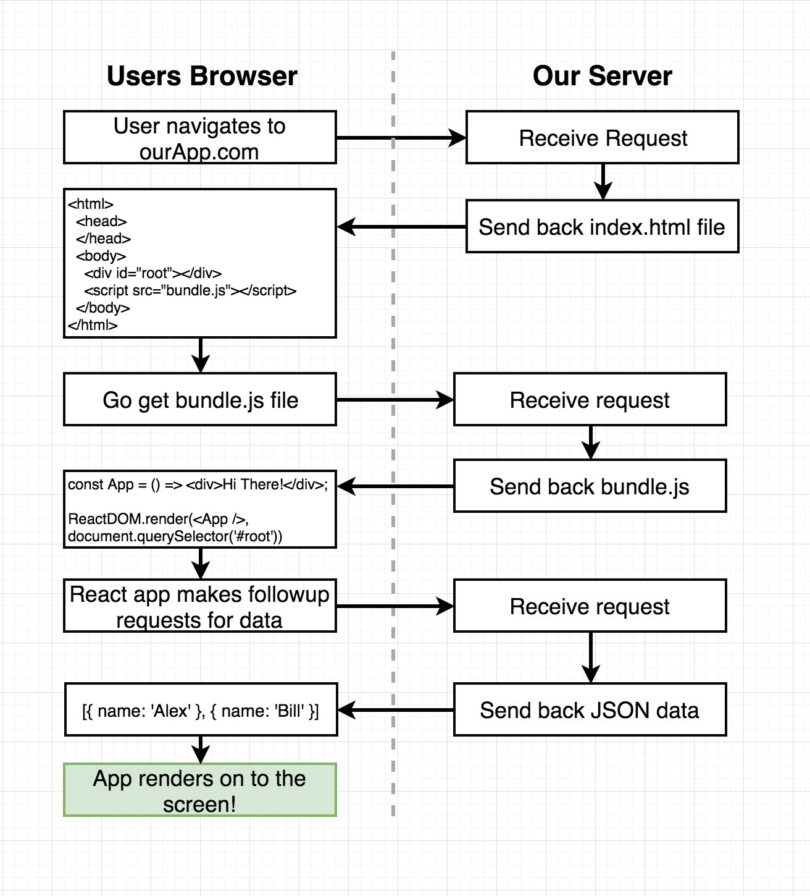
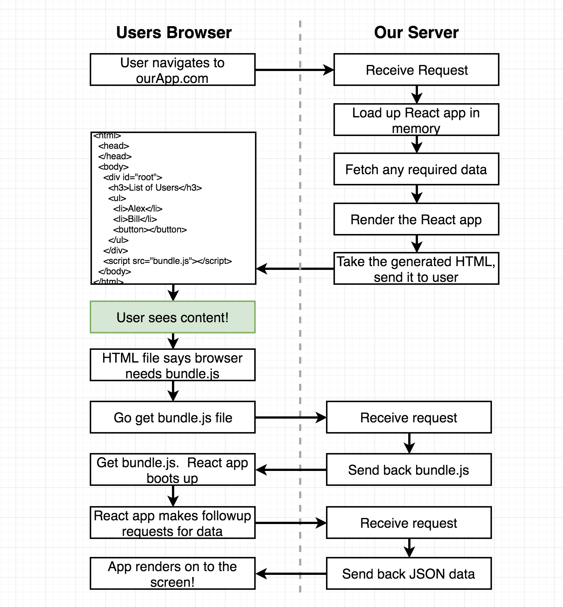
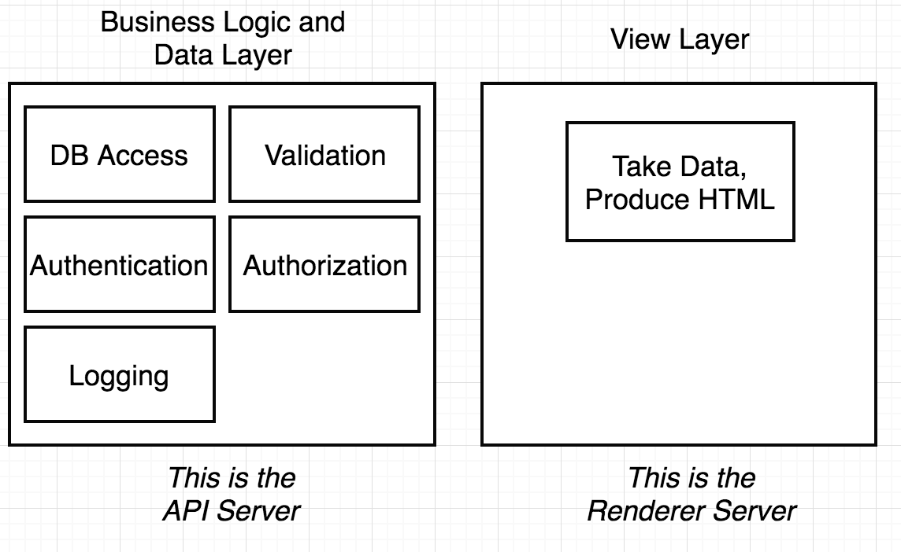

# ReactSSRCasts

Companion repo for a course hosted on Udemy.com

# Notes

### SSR Overview

Client side rendering general diagram: 

SSR general diagram: 


### Architecture

Generally speaking, there are two servers for the BE: one for the API and the other for the rendering logic.


The benefits of this arch is to easily and separately provision machines for those two parts.


### Courses

1. JSX on the server
    - Run webpack on all of our server side code, then execute the resulting bundle

2. Need to turn components to HTML
    - Use the `react-dom/server` libraries to `renderToString` function

3. Need to reduce the server side bundle
    - use `webpack-node-externals` in webpack to tell it not to bundle any libs into
    the server side bundle if it is already in `node_modules`. Because in ExpressJS, the node can 
    import the dependencies at the runtime.

4. Easy to bootup the two servers
    - use `npm-run-all --parallel dev:*`

5. The difference b/w `req.path` and `req.url` in ExpressJS v4.x
    - `req.url` is not a native Express property, it's inherited from Node's http module
    - `req.path` is the current path
        ```
            app.use('/admin', function(req, res, next) {  // GET 'http://www.example.com/admin/new'
                console.log(req.originalUrl); // '/admin/new'
                console.log(req.baseUrl); // '/admin'
                console.log(req.path); // '/new'
                next();
            });
        ```

6. 4 Big Redux Challenges on SSR
    1. Redux needs different configuration on browser vs server
    2. Aspects of authentication needs to be handled on server. Normally this is
        only on browser!
        1. can not use JWT (jason web token), only cookie/proxy based solution to avoid back and force b/w server
        2. 
    3. Need some way to detect when the initial data load action creators are completed on server
        1. solution #1: render twice. First to render the template, and let the client side fetch
            the data to re-render. This approach is against the purpose of server side rendering. 1) to render the contend behind the authentication, this can not do SSR. 2) let SSR happen twice is computationally expensive.
        2. solution #2: extract the data fetching logic and put them before the SSR. 1) need to write a lot of customized functions to help `react-router` to figure which component to render
    4. Need State rehydration on the browser
        - On server side, it fetches/puts the data into the template but after the client side loads it would request the data. The empty flash would occure in either cases, 1) when the client requesting the data and the payload state gets reset; 2) the inital state of the client does not take the state from the server side.

7. use `serialize-javascript` instead of `JSON.stringify` to put `__INITIAL_STATE__` into the DOM

8. `renderToString` v.s. `renderToNodeStream`